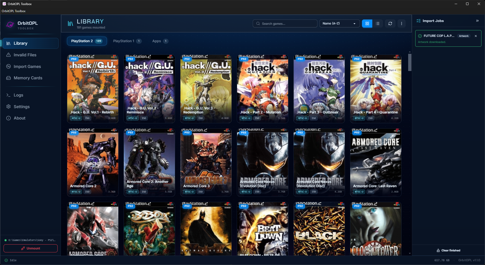
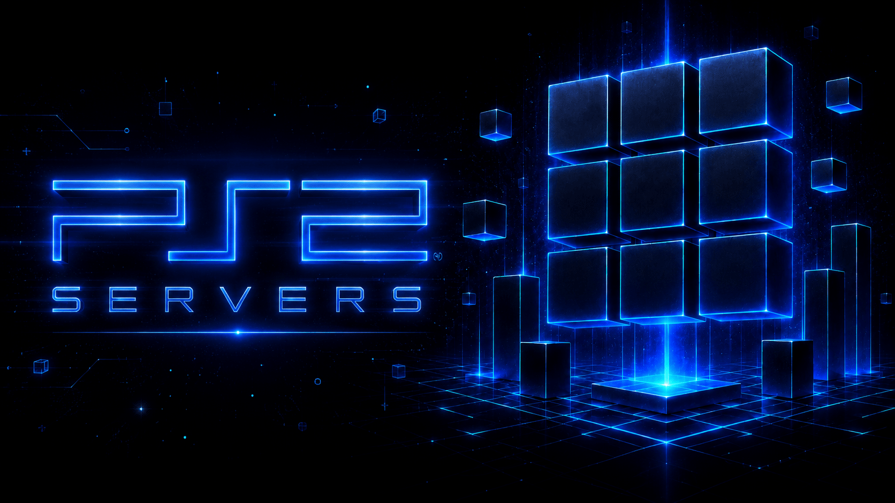

# PC Tools

-   __Orbital Toolbox__

    ---

    {:target="_blank" .md-button .md-button--stretch }

    Cross platform tool manage art and more for OPL/ISO loaders

-   __OPL Manager__

    ---

    {:target="_blank" .md-button .md-button--stretch }

    Windows only tool to manage art and install backups to PS2 APA disk.

-   __PS2 Servers__

    ---

    {:target="_blank" .md-button .md-button--stretch }

    Cross platform tool to start and share folders for hosting games/art over network  
    Supports SMBv1, UDPFS, UDPBD 

-   __OPL Server__

    ---

    {:target="_blank" .md-button .md-button--stretch }

    A dedicated Windowws SAMBA (SMBv1 Protocol) Server for OPL

    - OPL SHARE: PS2 (Despite whatever your folder share is named on Windows)
    - USERNAME: yourcomputerusername
    - PASSWORD: yourcomputerpassword
    - PORT: whatever you set in OPL-Server

-   __PFS BatchKit Manager__

    ---

    {:target="_blank" .md-button .md-button--stretch }

    Batch script that allows you to easily manage your PS2/PSX hard drive.

-   __SD2PSX Save Converter__

    ---

    {:target="_blank" .md-button .md-button--stretch }

    This script is useful if you have a lot of saved data and use the Game ID option with your sd2psx or MemCardPRO. It allows you to convert all your saves files to .mcd or .mc2 individually, each with its own Game ID.

-   __MyMC++__

    ---

    {:target="_blank" .md-button .md-button--stretch }

    MyMC++ is a PlayStation 2 memory card manager for use with .ps2 images created by PCSX2, as well as .mc2 files created by the MemCard PRO2 and .mcd created by SD2PSX

-   __MyMC++ Advanced GUI__

    ---

    {:target="_blank" .md-button .md-button--stretch }

    Fork of MyMC++ that has more features to manager VMCs, and is packaged as a Windows excecutable.

-   __Open ESR Disc Patcher__

    ---

    {:target="_blank" .md-button .md-button--stretch }

    Patch your legal PS2 DVD backups to be ESR compatible. ESR patched discs fool the PS2 into running the disc as a video DVD.

-   __PSX/PS2 Disc Patcher__

    ---

    {:target="_blank" .md-button .md-button--stretch }

    Patch your legal backups to master patched discs for use with MechaPwn or DTL-H TEST units.

-   __PS1 and PS2 game save archive WIP__

    ---

    !!! warning "LARGE FILE!"

        {:target="_blank" .md-button .md-button--stretch }

        390MB Download which expands to 168GB!

    [Syntax X :fontawesome-brands-discord:{ .pulse }][syntaxx] assembled the largest game save archive and started on a GUI. This is a WIP, if anyone wants to continue development please reach out!

    [syntaxx]: https://discord.com/users/265648646849036288 

    For example a search and export/import feature would be ideal!

  