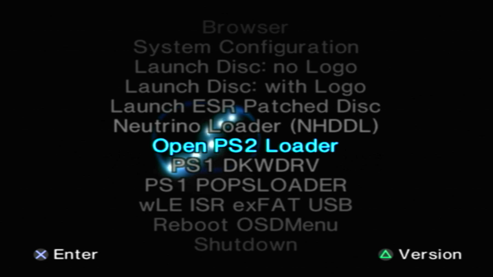
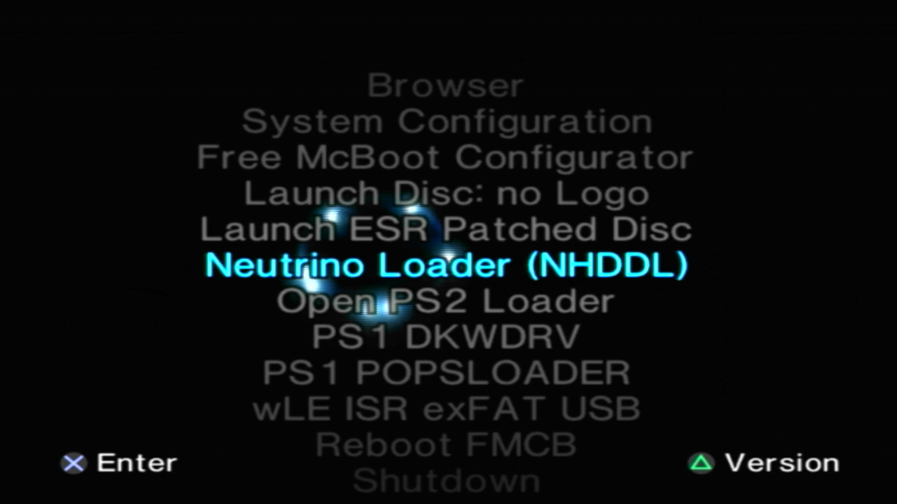
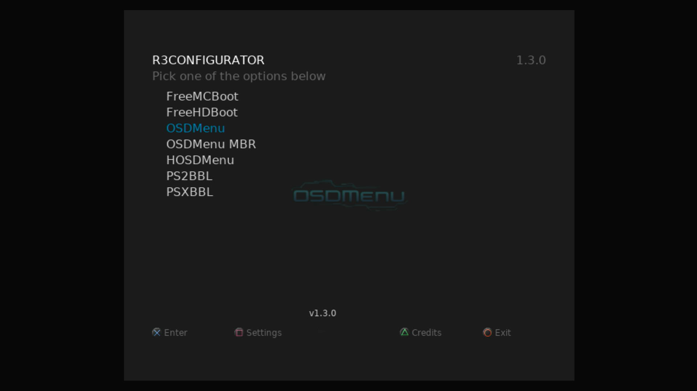
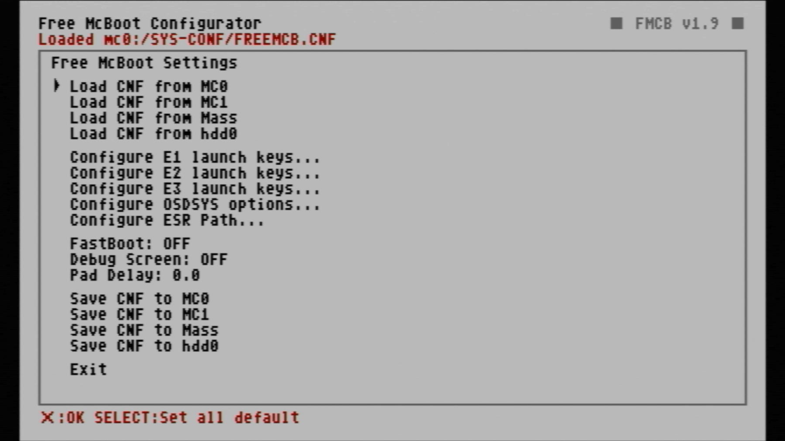
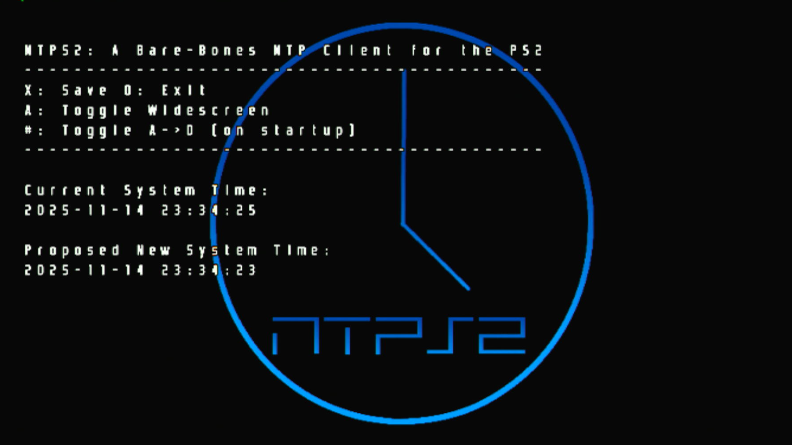

# System Apps

-   __OSDMenu__![sascompat][sas-compat]{ width="60" }![sas-psu_pic][sas-psu]{ width="75" }

    ---

    {:target="_blank"}

    Hacked OSDSYS like FMCB, however can launch apps from memcard browser, support for RetroGem, modchips. Too much to list! This is the new hotness!

    Supports FAT32/exFAT USB, APA/exFAT HDD, MMCE, MX4SIO, MemCard, i.Link, UDPBD, CDROM. 
    
    Edit `mc?:/SYS-CONF/OSDMENU.CFG` as needed. OSDMenu does not check paths, so everything in config file will be listed.

    [:material-cloud-download: OSDMenu](https://downloads.ps2homebrewstore.com/SAS/SYS_OSDMENU.psu)

-   __PS2BBL Extended__![sas-psu_pic][sas-psu]{ width="75" }

    ---

    {:target="_blank"}

    A fork of [El Isras PS2BBL](https://github.com/israpps/PlayStation2-Basic-BootLoader).  

    Launch keys/autoboot for PS2/PSX with OSDMenu features baked in: arg support, custom user logo, eGSM, PS1Vmode Negator and RetroGem visual Game ID
    Can also be used as a forwarder. 

 
    Supports Memory Card, USB, MMCE, MX4SIO, APA HDD, exFAT HDD

    [:material-cloud-download: BOOT](https://downloads.ps2homebrewstore.com/SAS/BOOT.psu)

-   __FreeMCBoot Decrypted__![sas-psu_pic][sas-psu]{ width="75" }

    ---

    {:target="_blank"}

    The Hacked OSDSYS that everyone knows, but is non-extensible and not open-source.
    Supports FAT32/exFAT USB, MemCard, CDROM.  
    Modchip users may need to use older versions.

    Edit `mc?:/SYS-CONF/FREEMCB.CNF` as needed or use the FreeMCBoot Configurator app.

    [:material-cloud-download: FMCBD 1.966](https://downloads.ps2homebrewstore.com/SAS/SYS_FMCBD-1966.psu)

    [:material-cloud-download: FMCBD 1.965](https://downloads.ps2homebrewstore.com/SAS/SYS_FMCBD-1965.psu)

    [:material-cloud-download: FMCBD 1.953](https://downloads.ps2homebrewstore.com/SAS/SYS_FMCBD-1953.psu)

    [:material-cloud-download: FMCBD 1.8C](https://downloads.ps2homebrewstore.com/SAS/SYS_FMCBD-18C.psu)

-   __R3Configurator__![sas-zip_pic][sas-zip]{ width="75" }

    ---

    {:target="_blank"}

    GUI to configure FMCB, FHDB, OSDMenu, OSDMenu MBR, HOSDMenu, and PS2BBL Extended

    [:material-cloud-download: R3Configurator](https://github.com/saildot4k/R3CONFIGURATOR/releases)  
    Extract zip to MMCE/USB/MX4SIO `device:/APPS/`  
    You will end up with: `device:/APPS/SYS_R3CONFIGURATOR/r3configurator.elf`

-   __FreeMCBoot Configurator__![sas-psu_pic][sas-psu]{ width="75" }

    ---

    

    GUI to modify the FreeMCBoot config file.

    [:material-cloud-download: FMCB Configurator](https://downloads.ps2homebrewstore.com/SAS/SYS_FMCB-CFG.psu)

-   __NTPS2__![sas-psu_pic][sas-psu]{ width="75" }

    ---

    {:target="_blank"}

     NTP client for the PS2 that sets the date and time from pool.ntp.org.  
     Network connection required!

    [:material-cloud-download: NTPS2](https://downloads.ps2homebrewstore.com/SAS/SYS_NTPS2.psu)

 

[sas-psu]: ../assets/badges/SASPSU.png
[sas-zip]: ../assets/badges/SASZIP.png
[sas-7z]: ../assets/badges/SAS7Z.png
[sas-7zip]: ../assets/badges/SAS7ZIP.png
[sas-rar]: ../assets/badges/SASRAR.png
[sas-ext]: ../assets/badges/SASEXTLINK.png

[non-sas-psu]: ../assets/badges/NOTSASCOMPLIANTPSU.png
[non-sas-zip]: ../assets/badges/NOTSASCOMPLIANTZIP.png
[non-sas-7z]: ../assets/badges/NOTSASCOMPLIANT7Z.png
[non-sas-7zip]: ../assets/badges/NOTSASCOMPLIANT7ZIP.png
[non-sas-rar]: ../assets/badges/NOTSASCOMPLIANTRAR.png
[non-sas-ext]: ../assets/badges/NOTSASCOMPLIANTEXTLINK.png

[umcs-psu]: ../assets/badges/UMCSPSU.png
[umcs-zip]: ../assets/badges/UMCSZIP.png
[umcs-7z:]: ../assets/badges/UMCS7Z.png
[umcs-7zip]: ../assets/badges/UMCS7ZIP.png
[umcs-rar]: ../assets/badges/UMCSRAR.png
[umcs-ext]: ../assets/badges/UMCSEXTLINK.png

[sas-compat]: ../assets/badges/sascompatible.png