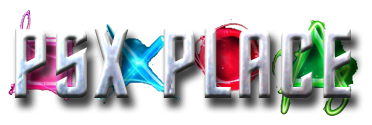

## SAS/UMCS Team

[Ripto][ripto]{:target="_blank" .md-button .md-button--stretch }

[korax][korax]{:target="_blank" .md-button .md-button--stretch }

[Berion][berion]{:target="_blank" .md-button .md-button--stretch }

[SpaceCoyote][spacecoyote]{:target="_blank" .md-button .md-button--stretch }

[Yornn][yornn]{:target="_blank" .md-button .md-button--stretch }

[techwritescode][techwritescode]{:target="_blank" .md-button .md-button--stretch }

[KrahJohlito]{:target="_blank" .md-button .md-button--stretch }

[nuno6573][nuno]{:target="_blank" .md-button .md-button--stretch }

[pcm720][pcm720]{:target="_blank" .md-button .md-button--stretch }

[HiroTex][hirotex]{:target="_blank" .md-button .md-button--stretch }

[Boon Tobias][boon]{:target="_blank" .md-button .md-button--stretch }

[Cosmic Scale][cosmic]{:target="_blank" .md-button .md-button--stretch }

[bucanero][bucanero]{:target="_blank" .md-button .md-button--stretch }

_YOU could be here! Contact us on_ [:fontawesome-brands-discord:{ .pulse }][discord] and [:fontawesome-brands-github:{ .pulse }][github]

[ripto]: https://github.com/NathanNeurotic
[yornn]: https://github.com/mcoirault
[korax]: https://github.com/koraxial
[berion]: https://www.psx-place.com/members/berion.1431/#resources
[krahjohlito]: https://github.com/KrahJohlito
[pcm720]: https://github.com/pcm720
[hirotex]: https://github.com/HiroTex
[boon]: https://github.com/Spaghetticode-Boon-Tobias
[cosmic]: https://github.com/CosmicScale
[bucanero]: https://github.com/bucanero
[techwritescode]: https://github.com/techwritescode
[spacecoyote]: https://www.psx-place.com/members/spacecoyote.86651/
[nuno]: https://github.com/nuno6573?tab=repositories
[github]: https://github.com/saildot4k/ps2homebrewstore "PS2 Homebrew Store Github"
[discord]: https://discord.gg/r3frDccRby "PS2 Space Discord"

## Links

-   __PS2 Modchip Tutorials__

    ---

    [{ width="200" }][ps2modchiptutorials]{:target="_blank"}
    ///caption
    Another site that tries to follow such structure, but directed more to the lucky modchip master race. Hint, the web designer here collaborated on same MMCE downloads!
    ///

-   __PS2 Space Discord Server__

    ---

    [{ width="275" }][discord]{:target="_blank"}
    ///caption
    Discord server full of great people willing to help!
    ///

-   __PSX Place Forums__

    ---

    [{ width="600"}][psx-place]{:target="_blank"}
    ///caption
    Forums dedicated to all things Playstation, specializing in homebrew.
    ///

-   __Console Mods__

    ---

    [{ width="360" }][consolemods]{:target="_blank"}
    ///caption
    Wiki full of console information
    ///

-   __PS2 Dev Wiki__

    ---

    [{ width="220" }][ps2devwiki]{:target="_blank"}
    ///caption
    Wiki full of PS2 Specific information
    ///

-   __PS2 Homebrew Github__

    ---

    [{ width="350" }][ps2homebrew_github]{:target="_blank"}
    ///caption
    ps2homebrew is a collection of free tools for the Sony PlayStation 2® videogame system and similar hardware.
    ///

## No Thanks to:

!!! danger "TnA Plastic"

    __TnA Plastic__ of ~~r/PS2Homebrew~~, _psx-place.com_ and _PS2 Scene_ Discord due to his atrocious persecutory behavior silencing anyone that disagrees and harassing those that are trying to learn, especially noobs, muting those poor souls for hours or days and proceeding to shit on those he muted/kicked/banned.  

    While _TnA_ (aka _Plastic_, _TnA Plastic_) did have a vision for SAS/UMCS there was no ACTUAL work done by him which is par for the course over almost 2 decades. There is no "invention" by him, but rather others building the vision. TnA...fuck off. The SAS/UMCS contributers decided to give him a "media blackout" as his mere presence in the scene is divisive . There can be no invention by someone that does __ZERO__ work, which is his Modus Operandi.  

    This message will remain until TnA is no longer a mod/admin/server of ANYTHING PS2 related. He has already been kicked as mod and user from multiple places for harassement and his disgusting behavior. Other PS2 related Discord servers have already taken steps and removed his discord server as a "Recommended Server".

    - Reddit: _r/PS2_ - kicked as a moderator
    
    - Discord: Perma-Bans
        - _PSX-Place_ (yet still allowed to be a mod at website!?)
        - _PS2 Homebrew_
        - _PS2 Space_
        - _Consolemods.org_
        - _Athena PS2 System_
        - _Bitfunx_

[ps2modchiptutorials]: https://ps2modchiptutorials.com "PS2 Modchip Tutorials"
[consolemods]: https://consolemods.org "Console Mods"
[ps2devwiki]: https://www.psdevwiki.com/ps2/ "PS2 Dev Wiki"
[ps2homebrew_github]: https://github.com/ps2homebrew "PS2 Homebrew Github"
[psx-place]: https://www.psx-place.com/forums/#playstation-2-ps2.6 "PSX-Place Forums"
