# Universal Memory Card Structure

Abbreviated UMCS, this aims to provide a very robust structure that works for all exploits and hopefully all modchips that support memory card boot via `mc?:/BOOT/BOOT.ELF`[^1]

This is the core of SAS (Save Application Strucure) so that there is minimal configuration end users need to do to run memory card based exploits.

Should you ever mess up your config, here are backups to restore. Follow the site [tutorial](../site_tutorial/index.md) to restore these files, otherwise if your PS2 still shows the PS2BBL boot logo, try `R1+Start` to boot `mass:/RESCUE.ELF`

!!! tip "RESCUE.ELF"

    Download and rename [wLE ISR exFAT](https://israpps.github.io/projects/wlaunchelf-isr) to `RESCUE.ELF` and place at root of USB stick.

-   __APPS__![umcs-psu_pic][umcs-psu]{ width="75" }

    ---

    

    [:material-cloud-download: APPS](https://downloads.ps2homebrewstore.com/SAS/APPS.psu)

    - __`mc?:/APPS/`__  
        Used by OpenTuna, Funtuna, Funtuna Fork and possibly more apps as hotkeys. Hoping to code out OpenTunas hotkeys and bad hardpaths.
    

    !!! tip "Use cases"

        A great place to put apps that do not have icons and define in your hacked OSDSYS config file because you hate to see corrupted icons in the MemCard Browser!

-   __BOOT__![umcs-psu_pic][umcs-psu]{ width="75" }

    ---

    

    [:material-cloud-download: BOOT](https://downloads.ps2homebrewstore.com/SAS/BOOT.psu)

    - __`mc?:/BOOT/`__  
        Where exploits look to boot from. 

    - __`mc?:/BOOT/BOOT.ELF`__  
        PS2BBL hotkeys and autoboot. Used to standardize both for all exploit types and apps that look for this path, which allows user to forward to another app using hotkeys. Supports all devices.

    - __`mc?:/BOOT/BOOT2.ELF`__  
        wLE R3Z file browser / ELF launcher

-   __SYS-CONF__![umcs-psu_pic][umcs-psu]{ width="75" }

    ---

    

    [:material-cloud-download: SYS-CONF](https://downloads.ps2homebrewstore.com/SAS/SYS-CONF.psu)

    - __`mc?:/SYS-CONF/`__  
        Configuration folder for the `BOOT` folder and other apps that look here.

    - __`mc?:/SYS-CONF/PS2BBL.INI` / `PSXBBL.INI`__  
        PS2BBL's config file. Supports unlimited paths.

    - __`mc?:/SYS-CONF/LAUNCHELF.CNF`__  
        uLE/wLE's config file

    - __`mc?:/SYS-CONF/OSDMENU.CNF`__  
        OSDMenu's config file

    - __`mc?:/SYS-CONF/FREEMCB.CNF`__  
        FreeMCBoot's config file

    - __`mc?:/SYS-CONF/IPCONFIG.DAT`__  
        Network config shared between many homebrew apps.

    !!! info "BDM Assault and exFAT"

        - __`mc?:/SYS-CONF/USBD.IRX`__ / __`USBHDFSD.IRX`__  
            USB drivers adding exFAT support ([BDM Assault][BDM_ASSAULT])  
        It is highly adviced to use MBR/FAT32 for most homebrew. exFAT is beneficial if USB is used for >4GB ISO's, but USB loading is the absolute worst way to play.

    [BDM_ASSAULT]: https://github.com/israpps/BDMAssault

    !!! tip "R3Configurator - GUI for FMCB, FHDB, OSDMenu, PS2BBL, PSXBBL config files"

        GUI to configure FMCB, FHDB, OSDMenu, OSDMenu MBR, HOSDMenu, and PS2BBL Extended

        [:material-cloud-download: R3Configurator](https://downloads.ps2homebrewstore.com/NON-SAS/SYS_R3CONFIGURATOR.zip)  
        Extract zip to MMCE/USB/MX4SIO `device:/APPS/`  
        You will end up with: `device:/APPS/SYS_R3CONFIGURATOR/r3configurator.elf`

## All Exploits lead to BOOT.ELF

```mermaid
---
config:
  theme: mc
  layout: dagre
  look: classic
---
graph LR
    A(["POWER ON"]) L_A_B_0@-- "BOOTROM 1.00-2.20<br>Excluding DTL-H3000*" --> B["SIGNED OSDSYS UPDATE<br>B?EXEC-SYSTEM<br>(LoadBOOTer)<br>Chainload:<br>mc?:/BOOT/BOOT.ELF"]
    A L_A_n1_0@-- "BOOTROM 2.30, 2.50<br>DEV 1 Modchips<br>Memory Cards w/o MagicGate" --> n1["OPENTUNA/DEV 1 CHIPS<br>Chainload:<br>mc?:/BOOT/BOOT.ELF<br>"]
    n5@{ label: "<pre style=\"font-family:\"><code style=\"font-family:\">mc?:/SYS-CONF/PS2BBL.INI</code></pre>" } --> n6["AutoLaunch<br>or<br>Hotkeys"]
    n6 -- AutoLaunch --> n7@{ label: "<span style=\"--tw-scale-x:\"><b><span style=\"--tw-scale-x:\">PS2BBL.INI AUTOLAUNCH</span><br style=\"--tw-scale-x:\"></b></span><br style=\"--tw-scale-x:\"><span style=\"background-color:\">1: EMPTY</span><br style=\"--tw-scale-x:\"><br style=\"--tw-scale-x:\"><span style=\"background-color:\">2: EMPTY</span><br style=\"--tw-scale-x:\"><br style=\"--tw-scale-x:\"><span style=\"--tw-scale-x:\">3: SYS_OSDMENU</span><br style=\"--tw-scale-x:\"><br style=\"--tw-scale-x:\"><span style=\"--tw-scale-x:\">4: SYS_FMCBD-1966</span><br style=\"--tw-scale-x:\"><br style=\"--tw-scale-x:\"><span style=\"--tw-scale-x:\">5: SYS_FMCBD-1965</span><br style=\"--tw-scale-x:\"><br style=\"--tw-scale-x:\"><span style=\"--tw-scale-x:\">6: SYS_FMCBD-1955<br style=\"--tw-scale-x:\"></span><br style=\"--tw-scale-x:\"><span style=\"background-color:\">7: SYS_FMCBD-18C</span><br style=\"--tw-scale-x:\"><br style=\"--tw-scale-x:\"><span style=\"--tw-scale-x:\">8: BOOT/BOOT2.ELF (wLE ISR exFAT)<br style=\"--tw-scale-x:\"><br style=\"--tw-scale-x:\">9: OSDSYS</span>" }
    B L_B_n8_0@-- <br> --> n8["mc?:/BOOT/BOOT.ELF<br>(PS2BBL)<br>./CONFIG.INI<br>DOES NOT EXIST!"]
    n1 L_n1_n8_0@-- <br> --> n8
    n8 L_n8_n5_0@-- Next config<br>search<br>pattern --> n5
    n10@{ label: "<pre style=\"--tw-scale-x:\"><code style=\"--tw-scale-x:\">mc?:/SYS-CONF/PSXBBL.INI</code></pre>" } --> n6
    n8 L_n8_n10_0@-- "PSX DESR-XXXX" --> n10
    A L_A_n11_0@-- "SCPH-10000<br>SCPH-15000<br>DTL-H10000(S)" --> n11["OSDSYS UPDATE<br>BIEXEC-SYSTEM<br>(ProtoPwn)<br>Chainload:<br>mc?:/BOOT/BOOT.ELF"]
    n11 L_n11_n8_0@--> n8

    B@{ shape: hex}
    n1@{ shape: event}
    n5@{ shape: lin-proc}
    n6@{ shape: diam}
    n7@{ shape: lin-proc}
    n8@{ shape: delay}
    n10@{ shape: lin-proc}
    n11@{ shape: event}
    classDef Ash stroke-width:1px, stroke-dasharray:none, stroke:#999999, fill:#EEEEEE, color:#000000
    classDef Sky stroke-width:1px, stroke-dasharray:none, stroke:#374D7C, fill:#E2EBFF, color:#374D7C
    style A fill:#00C853
    style B color:#FFFFFF,fill:#AA00FF
    style n1 color:#00C853,fill:transparent
    style n5 fill:#FFF9C4,color:#00C853
    style n6 fill:#00C853,color:#000000
    style n7 fill:#FFF9C4
    style n8 fill:#FF6D00
    style n10 fill:#FFF9C4,color:#00C853
    style n11 color:#00C853,fill:transparent
    linkStyle 0 stroke:#AA00FF,fill:none
    linkStyle 1 stroke:#00C853,fill:none
    linkStyle 2 stroke:#00C853,fill:none
    linkStyle 3 stroke:#00C853,fill:none
    linkStyle 4 stroke:#FF6D00,fill:none
    linkStyle 5 stroke:#FF6D00,fill:none
    linkStyle 6 stroke:#000000,fill:none
    linkStyle 7 stroke:#00C853,fill:none
    linkStyle 9 stroke:#00C853,fill:none
    linkStyle 10 stroke:#FF6D00,fill:none

    L_A_B_0@{ animation: slow } 
    L_A_n1_0@{ animation: slow } 
    L_B_n8_0@{ animation: slow } 
    L_n1_n8_0@{ animation: slow } 
    L_n8_n5_0@{ animation: slow } 
    L_n8_n10_0@{ animation: slow } 
    L_A_n11_0@{ animation: slow } 
    L_n11_n8_0@{ animation: slow }
```

!!! info "Landing on your hacked OSDSYS of choice:"

    PS2BBL.INI and PSXBBL.INI are setup so that minimal config changes are needed if at all. To land on your hacked OSDSYS of choice, install the [OSDMenu/ FMCB Version XXXX](../apps/index.md#system-apps) as needed. If multiple are installed (such as the MMCE AIO downloads), you can delete in order from first to last to land on the desired app. This is especially useful for modchip users as they may not play well or at all with some or all of the OSDSYS such as I believe Mars Pro. In that case, just delete all of the SYS_OSDMENU and SYS_FMCB-XXXX folders. Modchip users may need to disable chip to do so.

!!! tip "Hotkeys"

    During the PS2BBL logo, you have 4 seconds to activate run these options. On some like R1, it will go down the list till one is found, else exit to OSDSYS.

    { width="800" .on-glb }
    ///caption
    Config @ mc?:/SYS-CONF/PS2BBL.INI and OSDMENU.CNF
    ///

[sas-psu]: ../assets/badges/SASPSU.png
[sas-zip]: ../assets/badges/SASZIP.png
[sas-7z]: ../assets/badges/SAS7Z.png
[sas-7zip]: ../assets/badges/SAS7ZIP.png
[sas-rar]: ../assets/badges/SASRAR.png
[sas-ext]: ../assets/badges/SASEXTLINK.png

[non-sas-psu]: ../assets/badges/NOTSASCOMPLIANTPSU.png
[non-sas-zip]: ../assets/badges/NOTSASCOMPLIANTZIP.png
[non-sas-7z]: ../assets/badges/NOTSASCOMPLIANT7Z.png
[non-sas-7zip]: ../assets/badges/NOTSASCOMPLIANT7ZIP.png
[non-sas-rar]: ../assets/badges/NOTSASCOMPLIANTRAR.png
[non-sas-ext]: ../assets/badges/NOTSASCOMPLIANTEXTLINK.png

[umcs-psu]: ../assets/badges/UMCSPSU.png
[umcs-zip]: ../assets/badges/UMCSZIP.png
[umcs-7z:]: ../assets/badges/UMCS7Z.png
[umcs-7zip]: ../assets/badges/UMCS7ZIP.png
[umcs-rar]: ../assets/badges/UMCSRAR.png
[umcs-ext]: ../assets/badges/UMCSEXTLINK.png

[^1]: Modchips usually require the BOOT folder to be in Memory Card Slot 1 (`mc0:/BOOT/BOOT.ELF`) such as Matrix Infinity, DMS3/4, Ghost 2 and Modbo/Mars Pro